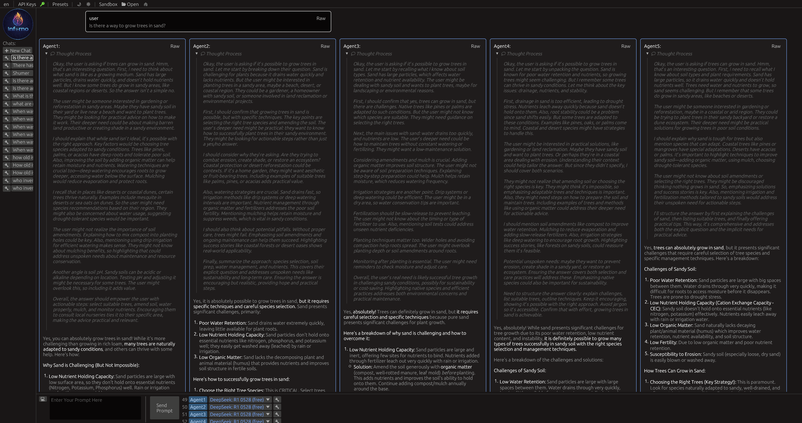

# inforno
Desktop Application for Exploring Large Language Models



The goal of the project is to create a desktop application for centralized
access to any or all of the LLM models supported by Ollama and Openrouter. For
simple tasks free models can do the job (they can even be run simultaneously).
For more complicated tasks it might be necessary to use the bigger, paid models.
Openrouter is prepayed pay-as-you-go service without any monthly or yearly fees.
Also, Openrouter allows you to limit each key's money usage so you cannot
overspend.

# Intro Video

[](https://www.youtube.com/watch?v=oJyj0mroFtY)

The Chats are stored locally in Sandbox files with the extension of .rno

To use Openrouter, you need to provide an Openrouter key, which you can obtain
by simply logging in to openrouter.ai and pressing the "Get API Key" button.

You can enter API key into the application directly using the API Key button
in the top menubar. Or, you can provide it as OPENROUTER_API_KEY environment
variable. Third option is to use an .env file in the same directory or in any
parent directory as the executable file. The format of the .env file is like
this:

```
OPENROUTER_API_KEY=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
```

You need Rust compiler and cargo to build this project. Makefile is optional,
it's just there to unify the devops across different build tools

# build and run:
make run

# or, if make is not installed:
cargo run --release

# to build for Windows:
make win

# or, without make:
cargo build --target=x86_64-pc-windows-gnu --release
rcedit target/x86_64-pc-windows-gnu/release/inforno.exe --set-icon assets/icon.ico


