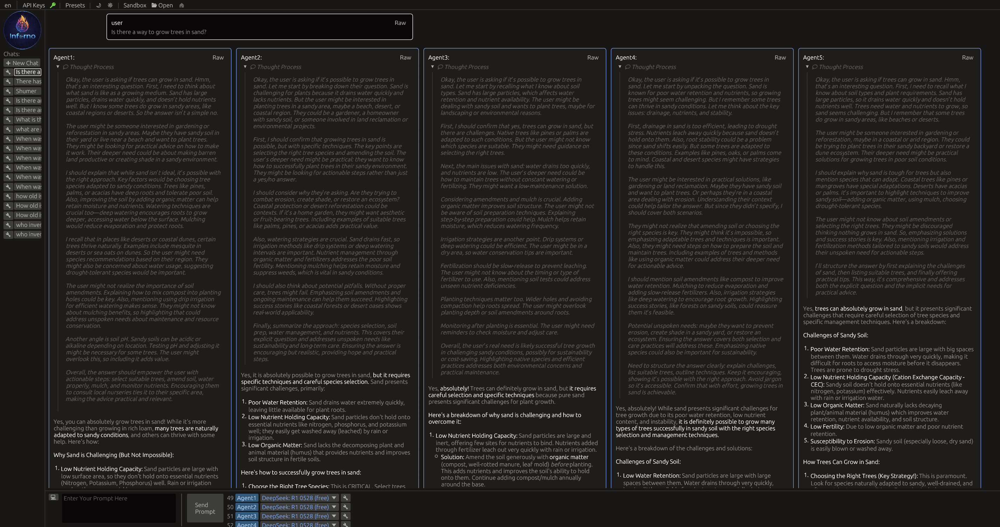

# Inforno
> An AI-Native Desktop GUI & IDE Environment for Exploring and Automating LLM Workflows in Rust.



**Inforno** is an extensible desktop application built with [egui](https://github.com/emilk/egui) that provides centralized access to local and cloud-based Large Language Models (LLM). It combines interactive LLM chat sessions, Jupyter-style notebooks, local VFS sandboxing ("Realms"), embedded code editing, and background daemon automation.

---

## 📽 Intro Video

[](https://www.youtube.com/watch?v=oJyj0mroFtY)

---

## 🏗 Workspace Architecture

The project is structured as a modular Cargo workspace:

| Crate | Type | Description |
| :--- | :--- | :--- |
| **`inforno_gui`** | `Binary` | The primary frontend application providing chat windows, notebook views, preset editors, and tile-based IDE layouts. |
| **`inforno_core`** | `Library` | Core backend engine handling SQLite storage, OpenRouter & Ollama client streaming, Realm path isolation, and Rhai scripting execution. |
| **`autorno`** | `Daemon` | Headless autonomous daemon worker that opens OS sockets to run automated prompt loops, scripts, and note cells across realms. |
| **`bulat`** | `Library / Binary` | Fast, lightweight text editor and side-by-side code diffing tool with custom themes and extensible syntax highlighting. |

---

## ✨ Key Features

* **Multi-Provider LLM Integration:**
  * **Ollama Support:** Connect to locally hosted models with automatic installed-model discovery and pull management.
  * **OpenRouter** Pay-as-you-go cloud access.
* **Realms & Secure VFS:**
  * Organize work across multiple projects (stable/unstable branches) within centralized "Realms."
  * Virtual File System (VFS) with alias-based path resolution (`/project_name/dev/src/main.rs`) preventing directory escaping and resolving canonical symlink paths securely.
* **Interactive Notebooks & Rhai Scripting:**
  * Jupyter-style Note Cells integrated into chats.
  * Execute Rhai scripts embedded directly inside Note Cells to automate iterative queries and prompt loops. (very experimental atm).
* **Embedded Editor & Merging (`bulat`):**
  * Custom syntax highlighting powered by `Logos` lexers and dynamic `Rhai` script loaders.
  * Interactive LLM patch application and side-by-side diff merging directly inside chat panes.
* **Typst & Math Rendering:**
  * Embedded Typst compiler for inline and block LaTeX/math SVG rendering inside assistant responses.

---

## 🔑 Key & Credentials Setup

Chats and local state are stored securely in `.rno` SQLite database sandboxes.

To use OpenRouter models, provide an API key using any of the following methods:
1. **In-App Manager:** Click the **API Key** button in the top menubar.
2. **Environment Variable:** Set `OPENROUTER_API_KEY`.
3. **Local `.env` File:** Create a `.env` file in the working directory:

```env
OPENROUTER_API_KEY=sk-or-v1-your-api-key-here
```

---

## 🛠 Building & Running

### Prerequisites
* [Rust Compiler & Cargo](https://www.rust-lang.org/tools/install) (Edition 2024 / MSRV supported by workspace dependencies)
* C compiler toolchain for SQLite bundling (`cc` / `gcc` / `MSVC`)

### Running `inforno_gui`
From the workspace root:

```bash
# Run GUI application in development mode
cargo run

# Run GUI application in release mode
cargo run --release
```

### Running Sub-Crates & Tools
```bash
# Run the Autorno daemon
cargo run -p autorno

# Run standalone Bulat editor/diff tool
cargo run -p bulat -- path/to/file.rs
cargo run -p bulat -- left.rs right.rs
```

### Cross-Compiling for Windows
```bash
# Build release executable for x86_64 Windows
cargo build --target=x86_64-pc-windows-gnu --release --bin inforno_gui

# Set application icon (optional tool)
rcedit target/x86_64-pc-windows-gnu/release/inforno_gui.exe --set-icon assets/icon.ico
```

---

## 📄 License

This project is licensed under MIT license.
